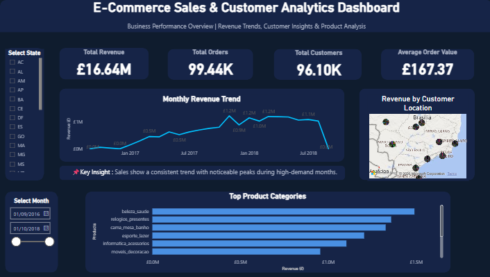
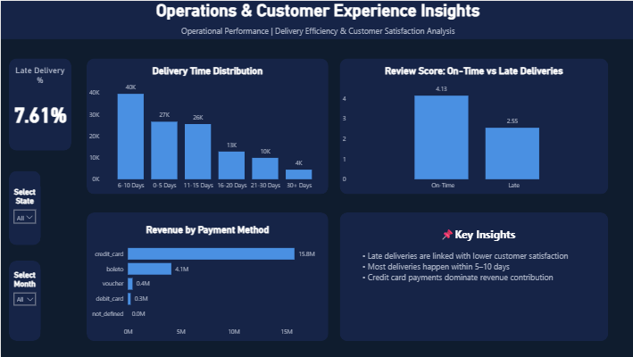

# 📊 End-to-End E-Commerce Sales & Customer Analytics Dashboard
## 🖼️ Dashboard Preview

### Business Overview

### Operations & Customer Insights

---

## 🚀 Project Highlights
- Built an end-to-end analytics solution using Python, SQL, and Power BI  
- Analysed sales performance, customer behaviour, and operational efficiency  
- Created interactive dashboards for business decision-making  
- Identified key factors affecting customer satisfaction  

---

## 📂 Dataset

This project is based on the **Olist Brazilian E-commerce Dataset**, a real-world dataset containing transactional data from an online marketplace.

### Dataset Includes:
- Customers (location, demographics)  
- Orders (purchase & delivery details)  
- Products (categories)  
- Payments (methods, value)  
- Reviews (customer feedback)  

These datasets were merged to create a unified analytical dataset.

📌 Source: https://www.kaggle.com/datasets/olistbr/brazilian-ecommerce

---

## 🛠️ Tools & Technologies
- Python (Pandas, NumPy)  
- SQL (PostgreSQL)  
- Power BI  
- Excel  

---

## 📈 Dashboard Features

### 🔹 Business Overview
- Revenue, Orders, Customers, AOV  
- Monthly Revenue Trend  
- Customer Location Map  
- Top Product Categories  

### 🔹 Operations & Insights
- Late Delivery %  
- Delivery Time Distribution  
- Review Score Analysis  
- Revenue by Payment Method  

---

## 📊 Key Insights
- Late deliveries significantly reduce customer satisfaction  
- Most deliveries occur within 5–10 days  
- Credit card payments dominate revenue  
- Few categories drive majority of sales  

---

## 💡 Business Recommendations
- Improve delivery timelines  
- Focus on high-performing categories  
- Optimize payment processes  
- Monitor performance using dashboards  

---

## 📄 Project Report

📥 Download Full Report:  
[Project Report](ecommerce_report.pdf)

---

## 📥 Download Dashboard
Power BI file available here: (https://drive.google.com/file/d/16OHA7fDih1SLboVjnE0Y9hALZ6unDK8w/view?usp=sharing)

---

## 📬 Contact
LinkedIn: (www.linkedin.com/in/mohd-hasan-128a18212)
